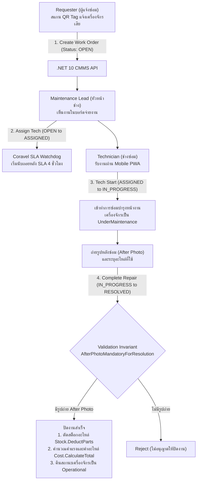
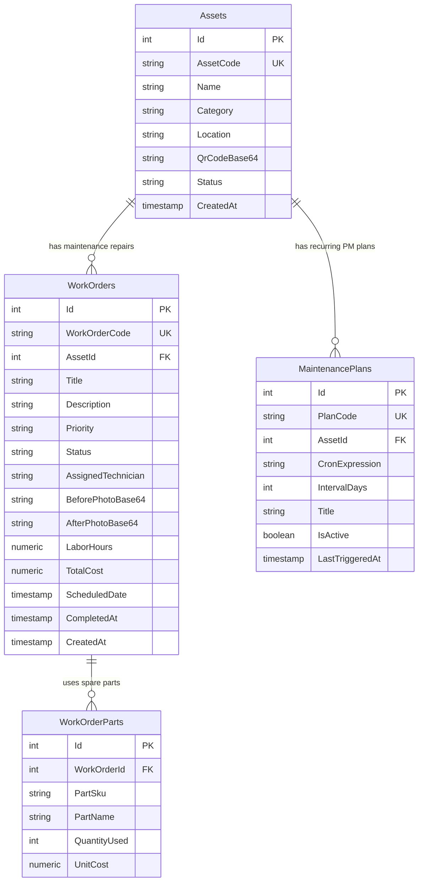

# 07_CMMS_ENGINE: Computerized Maintenance Management System

ระบบบริหารจัดการงานซ่อมบำรุงโรงงานและเครื่องจักรอุตสาหกรรม (CMMS) แบบครบวงจร พร้อมระบบสแกน QR Code หน้าเครื่องจักร, ระบบบีบอัดรูปภาพก่อนส่ง, ระบบนับถอยหลัง 4-Hour SLA Watchdog อัตโนมัติด้วย Coravel, และการตัดสต็อกอะไหล่ซ่อมบำรุง

---

## 🔄 ภาพรวม Workflow การทำงาน (Business & Technical Workflow)



### รายละเอียดขั้นตอนการเปลี่ยนสถานะ (State Transitions):
1. **`NEW ➔ OPEN` (Trigger: `CREATE_WO`)**: ผู้แจ้งซ่อมสแกน QR Code บนเครื่องจักร กรอกอาการเสีย และแนบรูปภาพก่อนซ่อม
2. **`OPEN ➔ ASSIGNED` (Trigger: `ASSIGN_TECH`)**: หัวหน้าช่างมอบหมายงานให้ช่างซ่อมที่มีความเชี่ยวชาญตรงสาย ระบบเริ่มนับถอยหลัง SLA 4 ชม. อัตโนมัติ
3. **`ASSIGNED ➔ IN_PROGRESS` (Trigger: `TECH_START`)**: ช่างซ่อมกดรับงานเมื่อเดินทางถึงหน้างาน เครื่องจักรจะเปลี่ยนสถานะเป็น "UnderMaintenance"
4. **`IN_PROGRESS ➔ RESOLVED` (Trigger: `COMPLETE_REPAIR`)**:
   - ช่างซ่อมต้องอัปโหลดรูปถ่ายหลังซ่อมเสร็จ (**บังคับตาม Invariant**)
   - บันทึกชั่วโมงแรงงานและรายการอะไหล่ที่ใช้
   - ระบบทำการตัดสต็อกอะไหล่จริงในคลัง และคำนวณต้นทุนรวมการซ่อมบำรุง

---

## 🗄️ Database Design & Entity Relationships (PostgreSQL 18)

### 1. Entity-Relationship Diagram (ER Diagram)



### 2. รายละเอียดตารางและความสัมพันธ์ (Schema & Relationships)
- **`Assets` (ทะเบียนเครื่องจักรและอุปกรณ์)**:
  - เก็บข้อมูลเครื่องจักร รหัสสินทรัพย์ (AssetCode), สถานะการทำงาน (`OPERATIONAL`, `UNDER_MAINTENANCE`, `DECOMMISSIONED`), และรูปภาพ Base64 ของ QR Code ติดหน้าเครื่องจักร
- **`WorkOrders` (ใบสั่งซ่อมบำรุง)**:
  - Foreign Key: `AssetId` ➔ `Assets(Id)` (บังคับตาม Invariant `WorkOrderMustLinkToValidAsset`)
  - เก็บสถานะ (`OPEN`, `ASSIGNED`, `IN_PROGRESS`, `RESOLVED`, `CANCELLED`), ลำดับความสำคัญ (`LOW`, `MEDIUM`, `HIGH`, `CRITICAL`), รูปถ่ายก่อนซ่อม/หลังซ่อม และชั่วโมงแรงงาน
  - ตารางนี้ทำงานร่วมกับ Invariant `AfterPhotoMandatoryForResolution` ที่ต้องมี `AfterPhotoBase64` ก่อนจะอัปเดตเป็น `RESOLVED`
- **`MaintenancePlans` (แผนซ่อมบำรุงเชิงป้องกัน - PM Schedule)**:
  - Foreign Key: `AssetId` ➔ `Assets(Id)`
  - เก็บรูปแบบความถี่รอบเวลาด้วย Cron Expression หรือจำนวนวัน (IntervalDays) สำหรับให้ Coravel Scheduler ประมวลผลสร้าง WorkOrder ล่วงหน้าอัตโนมัติ
- **`WorkOrderParts` (รายการอะไหล่ที่ใช้ในงานซ่อม)**:
  - Foreign Key: `WorkOrderId` ➔ `WorkOrders(Id)`
  - บันทึกการตัดสต็อกอะไหล่จริงและต้นทุนค่าซ่อมบำรุงรวม

---

## 🛡️ กฎเหล็กของระบบ (Domain Invariants)

1. **`WorkOrderMustLinkToValidAsset` (ใบแจ้งซ่อมต้องผูกกับเครื่องจักรที่มีอยู่จริง)**:
   - ป้องกันการสร้างใบแจ้งซ่อมลอยๆ ทุก Work Order ต้องผูกกับ Asset ID ที่ลงทะเบียนไว้ในระบบ เพื่อเก็บประวัติการซ่อมบำรุง (Maintenance History) และคำนวณค่า MTBF/MTTR ได้ถูกต้อง
2. **`AfterPhotoMandatoryForResolution` (ต้องมีรูปถ่ายหลังซ่อมจึงจะปิดงานได้)**:
   - ป้องกันการปิดงานซ่อมทิพย์ ช่างซ่อมทุกคนต้องถ่ายรูปชิ้นงานหรือเครื่องจักรหลังการซ่อมเสร็จเพื่อใช้เป็นหลักฐานยืนยันความปลอดภัยก่อนคืนเครื่องจักรเข้าสู่สายการผลิต

---

## 💻 Tech Stack & เหตุผลในการเลือกใช้

| ส่วนประกอบ | เทคโนโลยีที่เลือก | เหตุผลที่เลือก | ข้อดีหลัก (Advantages) |
|---|---|---|---|
| **Database** | **PostgreSQL 18** | มาตรฐาน RDBMS สำหรับจัดเก็บข้อมูลอุปกรณ์และประวัติการซ่อมบำรุง | มี Auto-Init Script (`db/init.sql`) พร้อมตาราง Assets และ WorkOrders |
| **Frontend UI (PWA)**| **Next.js 16 + React 19** | ออกแบบเป็น Progressive Web App (PWA) ใช้งานได้ทั้งบนมือถือและแท็บเล็ต | ช่างซ่อมสามารถติดตั้งเป็นแอปบนมือถือ พกพาไปตรวจงานหน้าเครื่องจักรได้สะดวก |
| **QR Code Scanner** | **html5-qrcode** | สแกน QR Code ผ่านกล้องเว็บแคมหรือกล้องมือถือได้โดยตรง | สแกนติดเร็วแม้ในสภาพแสงน้อยหน้าโรงงาน |
| **Image Optimizer** | **browser-image-compression** | บีบอัดรูปถ่ายความละเอียดสูงในเบราว์เซอร์ก่อนส่งขึ้นเซิร์ฟเวอร์ | ลดขนาดรูปจาก 10MB เหลือไม่เกิน 500KB ช่วยประหยัดพื้นที่จัดเก็บและอัปโหลดได้เร็วแม้เน็ตช้า |
| **Backend API** | **.NET 10 (C#)** | ประสิทธิภาพสูง รองรับงานประมวลผล Background Tasks ต่อเนื่อง | มั่นคง ปลอดภัย ทำงานร่วมกับ Coravel ได้อย่างไร้รอยต่อ |
| **Background Cron** | **Coravel Scheduler** | Lightweight Scheduler และ Invocables ในกระบวนการ .NET | ตรวจจับและแจ้งเตือน SLA Breached ทุกๆ 30 วินาที โดยไม่ต้องติดตั้ง Message Broker ภายนอก |
| **QR Code Engine** | **QRCoder** | สร้าง QR Code รูปภาพความละเอียดสูงสำหรับพิมพ์ติดป้ายเครื่องจักร | สร้าง QR Code แบบออฟไลน์ได้ทันที ไม่ต้องพึ่ง External API |

---

## 🚀 วิธีการรันระบบ (Quick Start)

### ตัวเลือกที่ 1: รันด้วย Docker Compose (แนะนำ)
```bash
docker compose up --build -d
```
> ระบบจะรัน **PostgreSQL 18** (`:5432`), **.NET 10 API** (`:5020`), และ **Next.js 16 Web** (`:3002`) พร้อม Seed เครื่องจักรและแผนซ่อมบำรุงให้ใช้งานได้ทันที

### ตัวเลือกที่ 2: รันแบบแยก Service (Manual)
1. **รัน Backend API**:
   ```powershell
   cd cmms-api
   dotnet run
   ```
   > API พร้อมทำงานที่: `http://localhost:5020`
2. **รัน Frontend Web**:
   ```powershell
   cd cmms-web
   bun run dev
   ```
   > เข้าใช้งานได้ที่: `http://localhost:3002`
